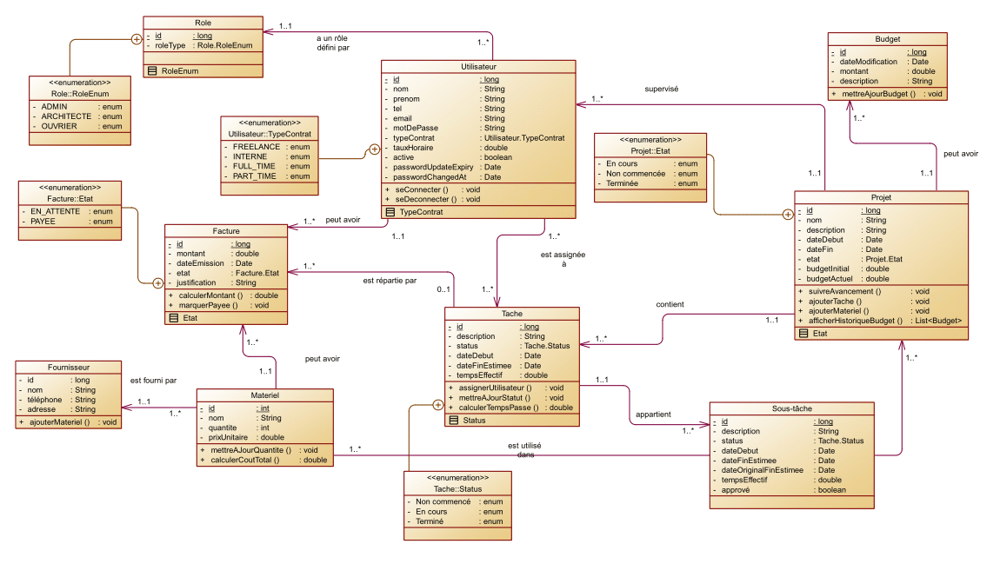
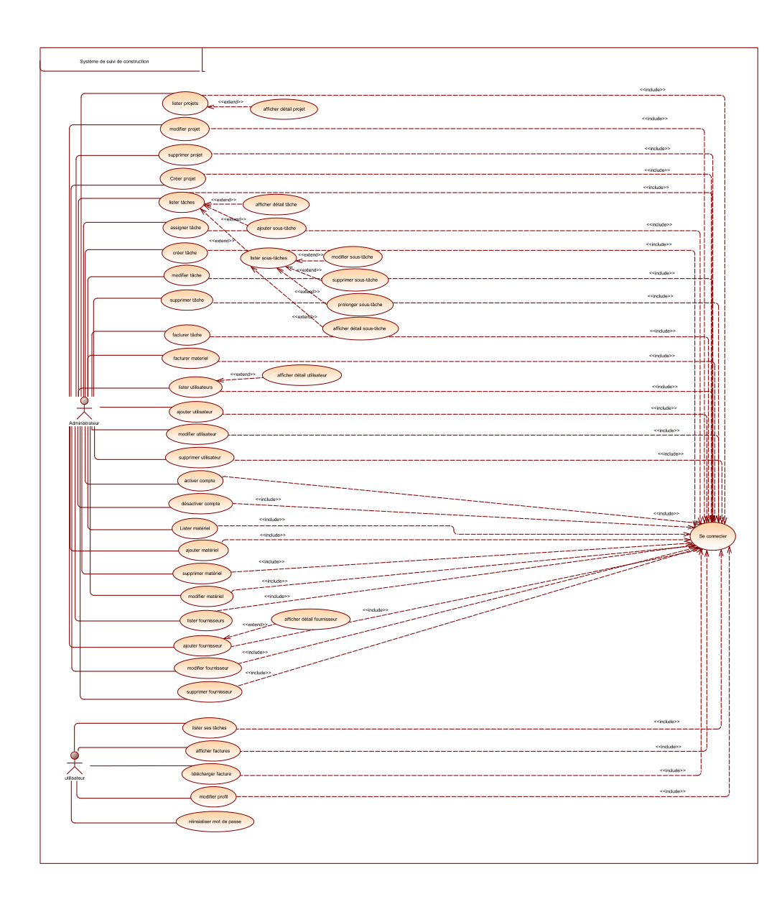

# 🚧 Gestion et suivi de projets de construction 🏗️

## 📝 Description du projet

Le secteur de la construction nécessite une gestion rigoureuse des projets, des acteurs (**architectes, ouvriers, fournisseurs**) et des ressources matérielles. Les entreprises de construction sont souvent confrontées à des **retards**, des **dépassements de budget** et un **manque de coordination**.

Ce projet vise à développer une **application web moderne** pour :

✅ Gérer les différents intervenants d’un projet de construction.  
✅ Suivre l’avancement des projets en **temps réel**.  
✅ Optimiser la gestion des **ressources** (matériaux, coûts, budgets).  
✅ Améliorer la **collaboration** entre les acteurs.

---  

## 🚀 Fonctionnalités principales

### 👥 Gestion des acteurs
- **🏛️ Gestion des architectes** : Affectation des tâches, suivi des plans, téléchargement des factures, réinitialisation du mot de passe en cas d'oubli, et modification du profil.
- **👷 Gestion des ouvriers** : Contrats, horaires, avancement des tâches, téléchargement des factures, réinitialisation du mot de passe en cas d'oubli, et modification du profil.

### 🏗️ Gestion des projets
- 🏆 **Création et planification des projets.**
- 📌 **Décomposition** des projets en **tâches et jalons**.
- 🔔 **Suivi en temps réel** de l’avancement et alertes en cas de retard.

### 📋 Gestion des tâches et sous-tâches
- **📌 Tâches** : CRUD des tâches, assignation des tâches aux acteurs et suivi de l'avancement.
- **📑 Sous-tâches** : CRUD des sous-tâches, prolongation des délais et suivi de l'avancement.

### 📦 Suivi des ressources
- 📊 **Gestion des matériaux.**
- 💰 **Historique des dépenses** par projet.
- 🧾 **Facturation** des tâches et des matériaux.

### 🔐 Gestion des utilisateurs par l'administrateur
- ➕ **Ajout d'un utilisateur** avec envoi d'un email contenant un **mot de passe aléatoire valable pour une heure**.
- ❌ Si le compte **n'est pas activé dans ce délai, il devient invalide**.
- ✅ **Activation manuelle** du compte par l'administrateur.

### 📈 Rapports et tableaux de bord
- 📊 **Suivi des performances des équipes**.
- 💲 **Rapports financiers** (budget, dépenses).

---  

## 🛠️ Technologies utilisées

| 🌐 **Technologie**  | 📌 **Description**  |  
|------------------|----------------|  
| **Backend**  | 🖥️ Spring Boot  |  
| **Frontend**  | 🎨 Angular  |  
| **Docker**  | 🐳 Containerisation de l'application  |  
| **Tests**  | ✅ JUnit pour les tests unitaires  |  
| **CI/CD**  | 🚀 GitHub Actions pour l'intégration continue et le déploiement continu  |  

---  

## 📊 Diagrammes

### 📌 Diagramme des classes


### 📌 Diagramme des cas d'utilisation


---  

## 🛠️ Installation et utilisation

### ✅ Prérequis

- ☕ **Java JDK 17**
- 🌍 **Node.js et npm** pour Angular
- 🐳 **Docker et Docker Compose**

### 📦 Installation

1️⃣ **Cloner le dépôt** :
   ```bash
   git clone https://github.com/kholoud001/Constructi.git
   
